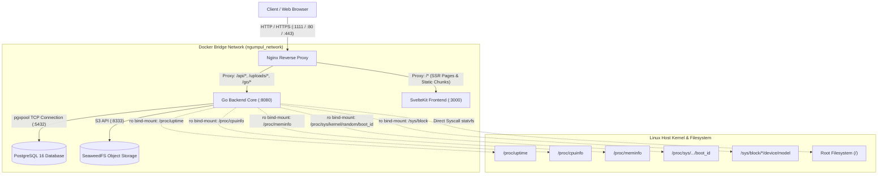
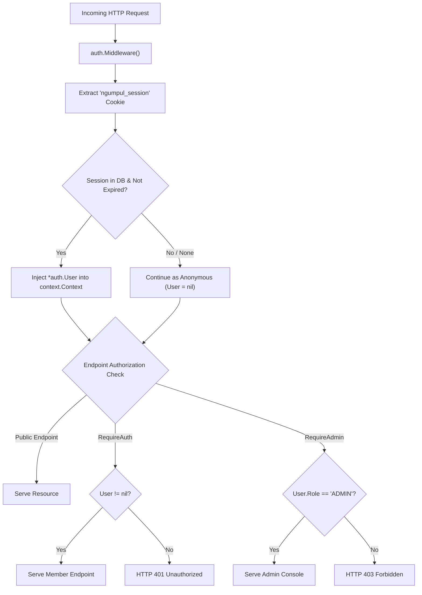

# System Architecture & Network Topology

> **Component:** System Architecture  
> **Status:** Active / Production Specification  
> **Target Environment:** Linux x86_64 / ARM64 (Docker Compose)

---

## 1. High-Level Architectural Topology

Ngumpul Host is designed as an independent, single-instance multi-user server application. It bridges low-overhead physical infrastructure with an editorial, human-scale web interface.

The infrastructure consists of five primary runtime components orchestrated via Docker Compose:
1. **Edge Ingress (`ngumpul_nginx_dev`):** Single public ingress handling HTTP routing, gzip compression, security headers, and upstream keepalive proxying.
2. **Web Frontend (`ngumpul_frontend_dev`):** SvelteKit 2 running in Node.js mode (`@sveltejs/adapter-node`) on port `3000`.
3. **Application Backend (`ngumpul_backend_dev`):** High-concurrency Go modular monolith listening on port `8080`.
4. **Data Persistence (`ngumpul_postgres_dev`):** PostgreSQL 16 database listening on port `5432` with volume persistence.
5. **Object Storage (`ngumpul_seaweedfs_dev`):** S3-compatible SeaweedFS object storage on private internal network port `8333`.

---

## 2. Tenancy & Authorization Model

Ngumpul Host explicitly rejects the complexity of multi-tenant SaaS architectures:
- **One Installation = One Community:** There is no concept of organizations or arbitrary tenant switching.
- **Ownership-Based Partitioning:** Data tables link to users via `owner_id` or `requester_id`. Users can only modify resources they own.
- **Role Hierarchy:**
  - `Public (Anonymous)`: Read-only access to public projects, member directory, activity ledger, and system telemetry.
  - `USER`: Community member. Can authenticate, manage profile, submit hosting requests, view their pending applications, and edit metadata of their approved projects.
  - `ADMIN`: Infrastructure operator. Has exclusive access to `/admin` routes, approvals, compute resource limits, role promotion, and security audit logs.

---

## 3. Network Ports & Environment Allocation

| Container Service | Internal Port | Host Port (Dev) | Host Port (Prod) | Upstream URL |
| :--- | :--- | :--- | :--- | :--- |
| **Nginx Ingress** | `80`, `443` | `1111` | `80`, `443` | Public entry point |
| **Frontend Node** | `3000` | None (internal) | None (internal) | `http://frontend:3000` |
| **Backend Core** | `8080` | None (internal) | None (internal) | `http://backend:8080` |
| **PostgreSQL** | `5432` | `5432` (optional dev bind) | None (internal) | `postgres:5432` |

### Reverse Proxy Principles
Nginx is strictly locked down:
- Routes only explicitly defined upstreams: `/api/` (API endpoints), `/uploads/` (static user media), `/go/` (tracking redirects), `/health`, and `/` (SvelteKit SSR application).
- Static assets under `/_app/immutable/` are sent with immutable long-lived cache headers (`Cache-Control: public, max-age=31536000, immutable`).
- All external traffic arrives through the Nginx container to ensure unified access logs and a single TLS-termination boundary.
- Nginx also enforces `client_max_body_size 10M` (aligned with the backend upload cap) and sends core security headers (`X-Frame-Options`, `X-Content-Type-Options`, `X-XSS-Protection`, `Referrer-Policy`).

> **Note:** Rate limiting is **not** enforced at the Nginx layer — all throttling lives in the Go backend (`internal/ratelimit`, IP sliding-window + per-user action limits). Full details: [`docs/security.md`](./security.md).
