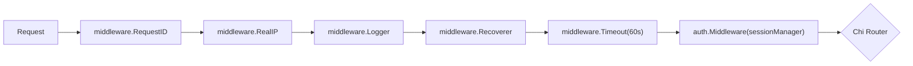

# Backend Architecture & Engineering Standards

> **Component:** Backend Core (`/backend`)  
> **Runtime:** Go 1.23+  
> **Router:** `go-chi/chi/v5`  
> **Database Driver:** `jackc/pgx/v5` with connection pooling (`*pgxpool.Pool`)  
> **Location:** [`docs/backend/architecture.md`](./architecture.md)

---

## 1. Modular Monolith Architecture

The backend is built as a single, coherent Go modular monolith. It avoids microservice fragmentation while enforcing strict boundaries between feature domains:

```
backend/
├── cmd/
│   └── server/
│       └── main.go          # Dependency injection & HTTP router assembly
├── internal/
│   ├── access/              # Registration policy & invite token verification
│   ├── activity/            # Public & admin chronological event streams
│   ├── admin/               # Metrics, operator audit trail & user management
│   ├── auth/                # Session manager, argon2id hashing, login/register & RBAC
│   ├── availability/        # Kernel uptime calculation, gap detection & incidents
│   ├── comment/             # Project discussion comments & author/operator deletion
│   ├── config/              # Environment variable loading & validation
│   ├── database/            # pgxpool lifecycle & automated schema migration
│   ├── hosting/             # Hosting request workflow (submit, review, approve, deploy)
│   ├── notification/        # In-app user notifications & alerts
│   ├── project/             # Project catalog, filtering, slugs & lifecycle
│   ├── report/              # Community moderation reports against projects/comments
│   ├── response/            # Standardized JSON response envelopes
│   ├── storage/             # File upload validation & local disk serving
│   ├── system/              # Linux kernel telemetry probes (/proc, /sys)
│   ├── user/                # Member directory & profile management
│   └── visits/              # Outbound click tracking (/go/:slug) & daily page views
├── migrations/
│   ├── 001_initial_schema.sql
│   ├── 002_media_objects.sql
│   ├── 003_access_and_invitations.sql
│   └── 004_comments_reports_and_visits.sql
├── go.mod
└── go.sum
```

---

## 2. Dependency Injection & State Rules

1. **Zero Global Variables:** Handlers and services must NEVER store state in package-level global variables.
2. **Explicit Constructor Injection:** Each domain package exposes a `NewHandler(...)` and/or `NewService(...)` that receives its dependencies (such as `*pgxpool.Pool`, configuration, or cross-cutting services) directly:
   ```go
   // Example: Explicit constructor in internal/project
   func NewHandler(pool *pgxpool.Pool) *Handler {
       return &Handler{pool: pool}
   }
   ```
3. **Database Connection Pooling:** PostgreSQL connections are managed exclusively through `*pgxpool.Pool` initialized at boot. Handlers obtain connections per request with context propagation (`r.Context()`), ensuring query timeouts and cancelations are respected.

---

## 3. Middleware Pipeline

Incoming requests traverse a standardized middleware chain before hitting business logic:



> **No CORS middleware.** nginx serves the frontend and `/api` from the same origin, so browsers never perform cross-origin checks. See [`docs/security.md`](../security.md#6-cors-configuration).

- **`middleware.Recoverer`:** Catches any unexpected panics, logs the stack trace, and sends a safe HTTP 500 JSON response without crashing the backend process.
- **`middleware.Timeout(60s)`:** Enforces a hard deadline on hanging requests, canceling database queries when the context expires.
- **`auth.Middleware`:** Reads the `ngumpul_session` cookie on every request. If valid, populates the request context with `*auth.User`. If invalid or absent, leaves `User = nil` without failing, allowing public endpoints to proceed seamlessly.
- **`auth.RequireRole("ADMIN")`:** Route-level guard enforcing administrative privileges.

---

## 4. Standardized Response Envelopes

All HTTP responses must use the helpers in `internal/response` to maintain API contract consistency across the entire frontend.

### Success Envelope (`response.JSON`)
```go
response.JSON(w, http.StatusOK, data, "Optional human-readable message")
```
Produces:
```json
{
  "data": { ... },
  "message": "Project details updated successfully"
}
```

### Error Envelope (`response.Error`)
```go
response.Error(w, http.StatusBadRequest, "BAD_REQUEST", "Invalid slug format")
```
Produces:
```json
{
  "error": {
    "code": "BAD_REQUEST",
    "message": "Invalid slug format",
    "details": null
  }
}
```

---

## 5. Process Lifecycle & Graceful Shutdown

The backend handles OS termination signals (`SIGINT`, `SIGTERM`) to guarantee zero request dropping and state corruption during Docker container restarts or deployments:

```go
quit := make(chan os.Signal, 1)
signal.Notify(quit, syscall.SIGINT, syscall.SIGTERM)
<-quit

log.Println("Shutting down backend gracefully...")
shutdownCtx, shutdownCancel := context.WithTimeout(context.Background(), 10*time.Second)
defer shutdownCancel()

if err := server.Shutdown(shutdownCtx); err != nil {
    log.Fatalf("Server forced to shutdown: %v", err)
}

availService.Stop() // Terminate background heartbeat ticker cleanly
pool.Close()        // Close database pool connections
log.Println("Backend server exited cleanly.")
```
