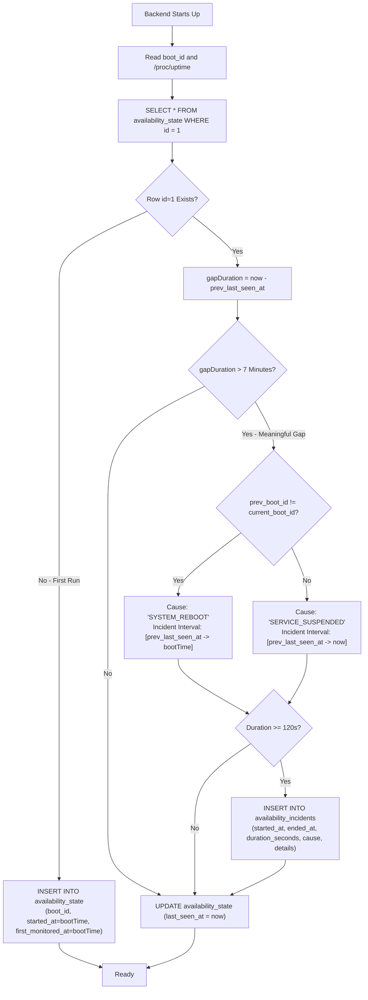

# Availability & Mathematical Uptime Engine

> **Subsystem:** Availability Engine (`backend/internal/availability`)  
> **Source Files:** `service.go`, `calculator.go`, `probes.go`, `types.go`, `format.go`  
> **Core Concept:** Kernel session tracking, in-place heartbeat state, and bounded integral uptime calculation  
> **Location:** [`docs/backend/availability.md`](./availability.md)

---

## 1. Problem Statement & Anti-Slop Philosophy

Most hobbyist and open-source status pages suffer from two fundamental design defects:

### Defect 1: Heartbeat Row Flooding
Naive status pages insert a new database row every 10 to 60 seconds.
- At 1 tick / 10s = 8,640 rows / day = **259,200 rows / month**.
- Over a year, this generates millions of dead rows, requiring vacuum maintenance, consuming disk space, and slowing queries.

### Defect 2: The New-Install False Downtime Trap
If a user deploys the application today and requests a "30-day availability history", a naive algorithm assumes the server was offline for the preceding 29 days, displaying an inaccurate `3.3% Uptime · Extreme Outage`.

### The Ngumpul Host Solution
1. **Zero Row Flooding:** Heartbeats update a **single row in-place** (`id = 1` in `availability_state`). New rows are created **only when a real downtime incident occurs** (`availability_incidents`).
2. **True Kernel-Aware Gap Detection:** The backend detects reboots and crashes by comparing the Linux Kernel Boot UUID (`/proc/sys/kernel/random/boot_id`) and system uptime.
3. **Bounded Integral Calculation:** Days prior to the initial deployment (`first_monitored_at`) are mathematically classified as `no_data` (neutral gray blocks) rather than false downtime.

---

## 2. Linux Kernel Telemetry Sources

The availability service queries two kernel-level data sources:

1. **`/proc/sys/kernel/random/boot_id`**: A 128-bit UUID generated when the Linux kernel initializes. It persists across process restarts and container restarts, changing **only when the physical machine reboots**.
2. **`/proc/uptime`**: The exact elapsed seconds since the system was powered on.

From these two primitives, the backend calculates the exact physical boot timestamp:
$$\text{bootTime} = \text{now} - \text{uptimeSeconds}$$

---

## 3. Database Schema for Availability

```sql
-- Single-row state table (tracks active session in-place)
CREATE TABLE IF NOT EXISTS availability_state (
    id INT PRIMARY KEY DEFAULT 1,
    boot_id VARCHAR(64) NOT NULL,
    started_at TIMESTAMPTZ NOT NULL,
    last_seen_at TIMESTAMPTZ NOT NULL,
    first_monitored_at TIMESTAMPTZ NOT NULL,
    heartbeat_count BIGINT NOT NULL DEFAULT 1,
    current_status VARCHAR(16) NOT NULL DEFAULT 'OPERATIONAL',
    CONSTRAINT single_row_state CHECK (id = 1)
);

-- Meaningful downtime incidents only (duration >= 120s)
CREATE TABLE IF NOT EXISTS availability_incidents (
    id BIGSERIAL PRIMARY KEY,
    started_at TIMESTAMPTZ NOT NULL,
    ended_at TIMESTAMPTZ NOT NULL,
    duration_seconds BIGINT NOT NULL,
    cause VARCHAR(64) NOT NULL, -- 'SYSTEM_REBOOT' or 'SERVICE_SUSPENDED'
    details TEXT NOT NULL DEFAULT '',
    created_at TIMESTAMPTZ NOT NULL DEFAULT NOW()
);
```

---

## 4. Startup Gap Detection & Incident Reconciliation

Every 5 minutes, a background goroutine performs an in-place heartbeat:
```sql
UPDATE availability_state
SET last_seen_at = NOW(), heartbeat_count = heartbeat_count + 1, current_status = 'OPERATIONAL'
WHERE id = 1;
```

When the service starts up (`Service.Initialize()`), it examines the previous state to reconcile any unrecorded downtime:



### Gap Detection Rules:
1. **Reboot Detection (`SYSTEM_REBOOT`):** When `prev_boot_id != current_boot_id`, the physical machine was restarted. The downtime began at `prev_last_seen_at` and ended when the kernel came back up at `bootTime`.
2. **Service Suspension (`SERVICE_SUSPENDED`):** When `prev_boot_id == current_boot_id`, the machine stayed on, but the application was stopped, crashed, or suspended. The downtime interval spans from `prev_last_seen_at` to `now`.
3. **Noise Filtering:** Outages under 120 seconds are discarded to prevent recording false incidents during rapid rolling restarts.

---

## 5. Mathematical Availability & Heatmap Algorithm

When a client requests `/api/status?range=30d`, `CalculateAvailability()` in `internal/availability/calculator.go` computes the metrics.

### 5.1. Range Parameters
- **`1d` (24 Hours):** 48 30-minute buckets ($N = 48$, duration = 30 minutes each). High-resolution intraday telemetry balancing granularity and mobile readability.
- **`7d` (7 Days):** 56 3-hour buckets ($N = 56$, duration = 3 hours each). Golden sweet spot balancing high intraday resolution with readability across mobile and desktop.
- **`30d` (30 Days):** 30 daily buckets ($N = 30$, duration = 24 hours each).

### 5.2. Mathematical Formulas

Let:
- $T_{\text{now}}$ be the current evaluation timestamp.
- $T_{\text{first}}$ be `first_monitored_at` from `availability_state`.
- Each bucket $i \in [0, N-1]$ have start time $B_{\text{start}}$ and end time $B_{\text{end}}$.

#### Step 1: Pre-Installation Check (Non-Penalization Rule)
If the bucket ended before the server was ever monitored:
$$\text{If } B_{\text{end}} \le T_{\text{first}} \implies \text{Status} = \text{no\_data}, \quad U_{\text{bucket}} = \text{null}$$

#### Step 2: Monitored Duration ($M_{\text{sec}}$)
Clamp the bucket boundaries to the active observation window:
$$M_{\text{start}} = \max(B_{\text{start}}, T_{\text{first}})$$
$$M_{\text{end}} = \min(B_{\text{end}}, T_{\text{now}})$$
$$M_{\text{sec}} = \max(M_{\text{end}} - M_{\text{start}}, 1)$$

#### Step 3: Downtime Overlap Calculation ($D_{\text{sec}}$)
For every incident $k \in \text{Incidents}$ intersecting with bucket $i$:
$$O_{\text{start}} = \max(I_{\text{start}, k}, M_{\text{start}})$$
$$O_{\text{end}} = \min(I_{\text{end}, k}, M_{\text{end}})$$
$$D_{\text{sec}} = \sum_{k} \max(0, O_{\text{end}} - O_{\text{start}})$$

#### Step 4: Bucket Uptime Percentage ($U_{\text{bucket}}$)
$$U_{\text{bucket}} = \text{clamp}\left( \text{round}\left( \frac{M_{\text{sec}} - D_{\text{sec}}}{M_{\text{sec}}} \times 100, 1 \right), 0, 100 \right)$$

#### Step 5: Bucket Visual State Resolution
$$\text{Status} = \begin{cases}
\text{operational} & \text{if } D_{\text{sec}} = 0 \\
\text{partial} & \text{if } 0 < D_{\text{sec}} < M_{\text{sec}} \\
\text{incident} & \text{if } D_{\text{sec}} \ge M_{\text{sec}}
\end{cases}$$

#### Step 6: Window-Wide Availability Metric ($A_{\text{period}}$)
The global availability percentage across all monitored time within the requested window is calculated as:

$$A_{\text{period}} = \text{round}\left( \frac{\sum_{i=0}^{N-1} M_{\text{sec}, i} - \sum_{i=0}^{N-1} D_{\text{sec}, i}}{\sum_{i=0}^{N-1} M_{\text{sec}, i}} \times 100, 2 \right)$$

---

## 6. Frontend Rendering in Svelte

In `frontend/src/lib/components/status/AvailabilityGrid.svelte`:
- `operational`: Solid calm green (`bg-emerald-500`)
- `partial`: Subdued amber (`bg-amber-400`)
- `incident`: Restrained rose (`bg-rose-500`)
- `no_data`: Neutral muted surface (`bg-neutral-800` / `bg-neutral-200`)

Each block includes full accessible tooltips displaying exact dates, calculated percentages, and incident summaries.

---

## 7. Project HTTP Availability Probing Worker

In addition to physical host kernel availability, Ngumpul Host includes an automated HTTP probe daemon for hosted software applications (`backend/internal/availability/project_checks.go`):

1. **Execution Cadence:** Every 5 minutes (`5 * time.Minute`), the daemon selects all published projects with active `public_url`s.
2. **Bounded Concurrency:** Probes are dispatched through a worker pool (bounded at 5 concurrent probes) to prevent socket exhaustion or spikes on the host node.
3. **Failure & Recovery Thresholds:**
   - **Offline Transition:** A project requires **2 consecutive failed probes** before its status transitions to `'OFFLINE'`, preventing transient network blips from creating false outage alarms.
   - **Instant Recovery:** A single successful probe immediately transitions an offline project back to `'ONLINE'`.
5. **Project Multi-Range Availability Engine:** Project showcase and owner management views call `GetProjectAvailabilityStats` to compute data-driven availability across 3 discrete observation windows:
   - **`1d` (24 Hours):** 24 hourly buckets ($N = 24$, 1 hour each).
   - **`7d` (7 Days):** 56 3-hour buckets ($N = 56$, 3 hours each).
   - **`30d` (30 Days):** 30 daily buckets ($N = 30$, 24 hours each).
6. **Pre-Deployment Non-Penalization Rule:** Buckets ending prior to `projects.created_at` are mathematically classified as `no_data` (`uptimePercent = nil`, "No recorded telemetry"). True percentage availability is strictly calculated over actual recorded checks, preventing newly deployed projects from being falsely penalized with synthetic outage days.
7. **Unified Vertical Bar Presentation:** Shared across platform status (`AvailabilityGrid.svelte`) and project health cards (`UptimeHistory.svelte`), rendering slim vertical bars (`rounded-[1.5px]`) with semantic ping latency color thresholds ($<150\text{ms}$ green, $150-400\text{ms}$ amber, $>400\text{ms}$ red).


