# Database Architecture & Schema Reference

> **Database:** PostgreSQL 16  
> **Driver:** `jackc/pgx/v5` via connection pool (`pgxpool.Pool`)  
> **Migrations Directory:** `backend/migrations/`  
> **Location:** [`docs/backend/database.md`](./database.md)

---

## 1. Entity Relationship Diagram (ERD)

```mermaid
erDiagram
    users ||--o{ sessions : "has"
    users ||--o{ projects : "owns"
    users ||--o{ hosting_requests : "submits"
    users ||--o{ activities : "generates"
    users ||--o{ notifications : "receives"
    users ||--o{ audit_logs : "initiates"
    users ||--o{ invitations : "creates"
    users ||--o{ comments : "authors"
    users ||--o{ reports : "files"

    projects ||--o{ activities : "associated with"
    projects ||--o{ comments : "receives"
    projects ||--o{ project_visits : "tracks"
    projects ||--o{ project_page_views : "records"
    projects ||--o{ project_availability_checks : "monitored by"

    users {
        uuid id PK
        varchar username UK
        varchar email UK
        varchar password_hash
        varchar display_name
        varchar role "USER | ADMIN"
        varchar status "PENDING_VERIFICATION | ACTIVE | SUSPENDED | DELETED"
        boolean email_verified
        timestamptz created_at
        timestamptz updated_at
    }

    sessions {
        varchar id PK
        uuid user_id FK
        timestamptz expires_at
        timestamptz created_at
    }

    projects {
        uuid id PK
        uuid owner_id FK
        varchar name
        varchar slug UK
        text description
        text readme
        varchar hosting_type "HOSTED_HERE | EXTERNAL"
        varchar status "PENDING | SETUP | ONLINE | OFFLINE | ARCHIVED"
        varchar visibility "PUBLIC | UNPUBLISHED | ARCHIVED"
        text[] technology_stack
        text public_url
        timestamptz published_at
        timestamptz created_at
        timestamptz updated_at
    }

    hosting_requests {
        uuid id PK
        uuid requester_id FK
        varchar project_name
        varchar subdomain
        text description
        text readme
        text repository_url
        text deployment_notes
        text[] technology_stack
        varchar status "PENDING | REVIEWING | APPROVED | REJECTED | SETUP | COMPLETED"
        text admin_notes
        uuid reviewed_by FK
        timestamptz reviewed_at
        timestamptz created_at
        timestamptz updated_at
    }

    activities {
        uuid id PK
        uuid actor_id FK
        uuid project_id FK
        varchar type
        jsonb metadata
        varchar visibility "PUBLIC | ADMIN"
        timestamptz created_at
    }

    notifications {
        uuid id PK
        uuid user_id FK
        varchar type
        varchar title
        text body
        jsonb data
        timestamptz read_at
        timestamptz created_at
    }

    audit_logs {
        uuid id PK
        uuid actor_id FK
        varchar action
        varchar target_type
        varchar target_id
        jsonb metadata
        timestamptz created_at
    }

    availability_state {
        int id PK "CHECK id = 1"
        varchar boot_id
        timestamptz started_at
        timestamptz last_seen_at
        timestamptz first_monitored_at
        bigint heartbeat_count
        varchar current_status
    }

    availability_incidents {
        bigserial id PK
        timestamptz started_at
        timestamptz ended_at
        bigint duration_seconds
        varchar cause "SYSTEM_REBOOT | SERVICE_SUSPENDED"
        text details
        timestamptz created_at
    }

    media_objects {
        uuid id PK
        varchar object_key UK
        bigint byte_size
        varchar content_type
        int width
        int height
        uuid uploaded_by FK
        timestamptz created_at
    }

    instance_settings {
        varchar key PK
        text value
        timestamptz updated_at
    }

    invitations {
        uuid id PK
        varchar token_hash UK
        uuid created_by FK
        varchar invited_email
        int max_uses
        int used_count
        timestamptz expires_at
        timestamptz revoked_at
        timestamptz created_at
    }

    comments {
        uuid id PK
        uuid project_id FK
        uuid author_id FK
        text content
        timestamptz created_at
        timestamptz updated_at
        timestamptz deleted_at
    }

    reports {
        uuid id PK
        uuid reporter_id FK
        varchar target_type "PROJECT | COMMENT"
        uuid target_id
        uuid project_id FK
        varchar reason "SPAM | ABUSE_HARASSMENT | INAPPROPRIATE | MALICIOUS_SUSPICIOUS | OTHER"
        text details
        varchar status "OPEN | REVIEWED | DISMISSED | RESOLVED"
        uuid resolved_by FK
        timestamptz resolved_at
        text action_notes
        timestamptz created_at
        timestamptz updated_at
    }

    project_visits {
        bigserial id PK
        uuid project_id FK
        timestamptz visited_at
        date date_bucket
    }

    project_page_views {
        uuid project_id PK "FK"
        date date PK
        int views_count
    }

    project_availability_checks {
        bigserial id PK
        uuid project_id FK
        timestamptz checked_at
        int status_code
        int response_time_ms
        boolean is_successful
        int consecutive_failures
    }
```

---

## 2. Complete Data Dictionary & Table Specifications

Every table in Ngumpul Host is documented below with exact column definitions, types, constraints, defaults, indexes, and operational invariants.

---

### 2.1. `users` — Community Members & Operators
Stores community member profiles, cryptographic password hashes, account lifecycle states, and role-based privileges.

| Column | Type | Constraints | Default | Description |
| :--- | :--- | :--- | :--- | :--- |
| `id` | `UUID` | `PRIMARY KEY` | `gen_random_uuid()` | Unique immutable identifier for the user. |
| `username` | `VARCHAR(64)` | `UNIQUE, NOT NULL` | — | URL-safe username for member profiles (`/people/:username`). |
| `email` | `VARCHAR(255)` | `UNIQUE, NOT NULL` | — | Account email address used for login and notifications. |
| `password_hash` | `VARCHAR(255)` | `NOT NULL` | — | Bcrypt hash (cost 10). Plaintext is never stored or logged. |
| `display_name` | `VARCHAR(128)` | `NOT NULL` | — | Human-readable name rendered on cards and comments. |
| `avatar_url` | `TEXT` | `NOT NULL` | `''` | Uploaded avatar image path or empty string. |
| `bio` | `TEXT` | `NOT NULL` | `''` | Short personal bio shown on public profile. |
| `role` | `VARCHAR(32)` | `NOT NULL, CHECK (role IN ('USER', 'ADMIN'))` | `'USER'` | Access control role (`USER` = member, `ADMIN` = operator). |
| `status` | `VARCHAR(32)` | `NOT NULL, CHECK (status IN ('PENDING_VERIFICATION', 'ACTIVE', 'SUSPENDED', 'DELETED'))` | `'ACTIVE'` | Account lifecycle status. |
| `email_verified` | `BOOLEAN` | `NOT NULL` | `true` | Email confirmation status flag. |
| `created_at` | `TIMESTAMPTZ` | `NOT NULL` | `NOW()` | Account creation timestamp. |
| `updated_at` | `TIMESTAMPTZ` | `NOT NULL` | `NOW()` | Last profile update timestamp. |

* **Indexes:** Primary key on `id`, unique btree on `username`, unique btree on `email`.
* **Invariants:**
  * System requires at least one active administrator at all times; self-demotion or self-suspension of the sole administrator is blocked at the service layer.
  * Deleting a user who owns active projects is rejected (`ON DELETE RESTRICT` on `projects.owner_id`).

---

### 2.2. `sessions` — Stateful Authentication Sessions
Tracks active authentication sessions associated with the `ngumpul_session` HttpOnly cookie.

| Column | Type | Constraints | Default | Description |
| :--- | :--- | :--- | :--- | :--- |
| `id` | `VARCHAR(128)` | `PRIMARY KEY` | — | 32-byte cryptographically secure random hex token string. |
| `user_id` | `UUID` | `NOT NULL, REFERENCES users(id) ON DELETE CASCADE` | — | Foreign key pointing to authenticated member. |
| `expires_at` | `TIMESTAMPTZ` | `NOT NULL` | — | Session expiration timestamp (typically 7 days rolling). |
| `created_at` | `TIMESTAMPTZ` | `NOT NULL` | `NOW()` | Session issuance timestamp. |

* **Indexes:** Primary key on `id`, `idx_sessions_user_id` on `(user_id)`, `idx_sessions_expires_at` on `(expires_at)`.
* **Lifecycle:** Expired sessions are cleaned up automatically or upon authentication failure. Deleting a user purges all active sessions immediately via cascade.

---

### 2.3. `projects` — Project Directory & Showcase Catalog
The central catalog of self-hosted community software and showcase applications.

| Column | Type | Constraints | Default | Description |
| :--- | :--- | :--- | :--- | :--- |
| `id` | `UUID` | `PRIMARY KEY` | `gen_random_uuid()` | Unique immutable identifier for the project. |
| `owner_id` | `UUID` | `NOT NULL, REFERENCES users(id) ON DELETE RESTRICT` | — | Foreign key pointing to the project author/creator. |
| `name` | `VARCHAR(128)` | `NOT NULL` | — | Human-readable title of the project. |
| `slug` | `VARCHAR(128)` | `UNIQUE, NOT NULL` | — | URL slug used in routes (`/projects/:slug` and `/go/:slug`). |
| `description` | `TEXT` | `NOT NULL` | `''` | Editorial description of the project and its capabilities. |
| `readme` | `TEXT` | `NOT NULL` | `''` | GitHub-style Markdown documentation rendered in project overview. |
| `cover_image_url` | `TEXT` | `NOT NULL` | `''` | Public path to uploaded cover image or empty. |
| `cover_image_key` | `TEXT` | `NOT NULL` | `''` | Internal storage key in `/data/uploads` / SeaweedFS. |
| `repository_url` | `TEXT` | `NOT NULL` | `''` | Source code repository URL (GitHub, GitLab, etc.). |
| `documentation_url` | `TEXT` | `NOT NULL` | `''` | Link to project manuals or documentation pages. |
| `demo_url` | `TEXT` | `NOT NULL` | `''` | Video or interactive demo URL. |
| `technology_stack` | `TEXT[]` | `NOT NULL` | `'{}'` | Native PostgreSQL array of tech tags (e.g. `['Go', 'Svelte']`). |
| `hosting_type` | `VARCHAR(32)` | `NOT NULL, CHECK (hosting_type IN ('HOSTED_HERE', 'EXTERNAL'))` | `'HOSTED_HERE'` | Hosting topology indicator. |
| `public_url` | `TEXT` | `NOT NULL` | `''` | Live outbound destination URL reached via `/go/:slug`. |
| `status` | `VARCHAR(32)` | `NOT NULL, CHECK (status IN ('PENDING', 'SETUP', 'ONLINE', 'OFFLINE', 'ARCHIVED'))` | `'ONLINE'` | Operational health and lifecycle state. |
| `visibility` | `VARCHAR(32)` | `NOT NULL, CHECK (visibility IN ('PUBLIC', 'UNPUBLISHED', 'ARCHIVED'))` | `'PUBLIC'` | Catalog visibility gate. |
| `published_at` | `TIMESTAMPTZ` | `NULL` | — | Timestamp when project was first made public. |
| `created_at` | `TIMESTAMPTZ` | `NOT NULL` | `NOW()` | Registration timestamp. |
| `updated_at` | `TIMESTAMPTZ` | `NOT NULL` | `NOW()` | Last metadata modification timestamp. |

* **Indexes:** `idx_projects_slug` on `(slug)`, `idx_projects_owner_id` on `(owner_id)`, `idx_projects_status` on `(status)`, `idx_projects_visibility` on `(visibility)`.
* **Invariants:** Only `PUBLIC` projects appear in public queries and RSS feeds. Outbound visits require a non-empty `public_url`.

---

### 2.4. `hosting_requests` — Container Hosting Intake Workflow
Tracks member submissions requesting homelab server provisioning for their projects.

| Column | Type | Constraints | Default | Description |
| :--- | :--- | :--- | :--- | :--- |
| `id` | `UUID` | `PRIMARY KEY` | `gen_random_uuid()` | Unique identifier for the intake ticket. |
| `requester_id` | `UUID` | `NOT NULL, REFERENCES users(id) ON DELETE CASCADE` | — | Foreign key pointing to applicant member. |
| `project_id` | `UUID` | `REFERENCES projects(id) ON DELETE SET NULL` | `NULL` | Optional reference to existing project (for subdomain change requests). |
| `request_type` | `VARCHAR(32)` | `NOT NULL` | `'NEW_PROJECT'` | Request category: `'NEW_PROJECT'` or `'SUBDOMAIN_CHANGE'`. |
| `project_name` | `VARCHAR(128)` | `NOT NULL` | — | Proposed application name. |
| `subdomain` | `VARCHAR(64)` | `NOT NULL` | `''` | Requested or assigned unique subdomain prefix (`.ngumpul.local`). |
| `description` | `TEXT` | `NOT NULL` | `''` | Short description (max 280 characters) or change reason. |
| `readme` | `TEXT` | `NOT NULL` | `''` | Submitted Markdown documentation or uploaded `.md` README. |
| `repository_url` | `TEXT` | `NOT NULL` | `''` | Public Git repository URL containing code/Dockerfile. |
| `documentation_url`| `TEXT` | `NOT NULL` | `''` | Supplementary docs or architectural notes. |
| `deployment_notes` | `TEXT` | `NOT NULL` | `''` | Resource requirements (RAM, ports, volumes, env keys). |
| `technology_stack` | `TEXT[]` | `NOT NULL` | `'{}'` | Proposed technologies. |
| `status` | `VARCHAR(32)` | `NOT NULL, CHECK (status IN ('PENDING', 'REVIEWING', 'APPROVED', 'REJECTED', 'SETUP', 'COMPLETED', 'CANCELLED'))` | `'PENDING'` | Application review lifecycle stage. |
| `admin_notes` | `TEXT` | `NOT NULL` | `''` | Operator feedback, container notes, or rejection reason. |
| `reviewed_by` | `UUID` | `REFERENCES users(id) ON DELETE SET NULL` | — | Administrator who processed the request. |
| `reviewed_at` | `TIMESTAMPTZ` | `NULL` | — | Timestamp of operator review. |
| `created_at` | `TIMESTAMPTZ` | `NOT NULL` | `NOW()` | Submission timestamp. |
| `updated_at` | `TIMESTAMPTZ` | `NOT NULL` | `NOW()` | Ticket modification timestamp. |

* **Indexes:** `idx_hosting_requests_requester_id` on `(requester_id)`, `idx_hosting_requests_status` on `(status)`, `idx_hosting_requests_subdomain` on `(subdomain)`, `idx_hosting_requests_project_id` on `(project_id)`, `idx_hosting_requests_request_type` on `(request_type)`.
* **Lifecycle:** `PENDING` $\rightarrow$ `REVIEWING` $\rightarrow$ `APPROVED` $\rightarrow$ `SETUP` $\rightarrow$ `COMPLETED` (or `REJECTED`/`CANCELLED`).

---

### 2.5. `activities` — Chronological Event Ledger
Immutable audit trail and public timeline feed tracking significant community milestones.

| Column | Type | Constraints | Default | Description |
| :--- | :--- | :--- | :--- | :--- |
| `id` | `UUID` | `PRIMARY KEY` | `gen_random_uuid()` | Unique event identifier. |
| `actor_id` | `UUID` | `REFERENCES users(id) ON DELETE SET NULL` | — | User who performed the action (or null for system). |
| `project_id` | `UUID` | `REFERENCES projects(id) ON DELETE SET NULL` | — | Project associated with event (if applicable). |
| `type` | `VARCHAR(64)` | `NOT NULL` | — | Action type (`PROJECT_PUBLISHED`, `HOSTING_REQUEST_APPROVED`, etc.). |
| `metadata` | `JSONB` | `NOT NULL` | `'{}'::jsonb` | Structured context payload (titles, slugs, operator notes). |
| `visibility` | `VARCHAR(32)` | `NOT NULL, CHECK (visibility IN ('PUBLIC', 'ADMIN'))` | `'PUBLIC'` | Target audience filter. |
| `created_at` | `TIMESTAMPTZ` | `NOT NULL` | `NOW()` | Event occurrence timestamp. |

* **Indexes:** `idx_activities_visibility_created` on `(visibility, created_at DESC)`, `idx_activities_project_id` on `(project_id)`.

---

### 2.6. `notifications` — In-App Member Notifications
Private notifications delivered to members regarding their projects, requests, and account events.

| Column | Type | Constraints | Default | Description |
| :--- | :--- | :--- | :--- | :--- |
| `id` | `UUID` | `PRIMARY KEY` | `gen_random_uuid()` | Notification identifier. |
| `user_id` | `UUID` | `NOT NULL, REFERENCES users(id) ON DELETE CASCADE` | — | Recipient member. |
| `type` | `VARCHAR(64)` | `NOT NULL` | — | Notification classification (`REQUEST_APPROVED`, `COMMENT_ADDED`). |
| `title` | `VARCHAR(255)` | `NOT NULL` | — | Concise notification headline. |
| `body` | `TEXT` | `NOT NULL` | — | Detailed explanation or message content. |
| `data` | `JSONB` | `NOT NULL` | `'{}'::jsonb` | Context payload (e.g. `{"slug": "atlas", "request_id": "..."}`). |
| `read_at` | `TIMESTAMPTZ` | `NULL` | — | Read acknowledgment timestamp (null = unread). |
| `created_at` | `TIMESTAMPTZ` | `NOT NULL` | `NOW()` | Delivery timestamp. |

* **Indexes:** `idx_notifications_user_id` on `(user_id, created_at DESC)`.

---

### 2.7. `audit_logs` — Tamper-Resistant Operator Audit Trail
Administrative log recording sensitive configuration updates and governance operations.

| Column | Type | Constraints | Default | Description |
| :--- | :--- | :--- | :--- | :--- |
| `id` | `UUID` | `PRIMARY KEY` | `gen_random_uuid()` | Audit log identifier. |
| `actor_id` | `UUID` | `REFERENCES users(id) ON DELETE SET NULL` | — | Administrator performing the action. |
| `action` | `VARCHAR(64)` | `NOT NULL` | — | Action name (`USER_PROMOTED`, `SETTINGS_CHANGED`, `PROJECT_ARCHIVED`). |
| `target_type` | `VARCHAR(64)` | `NOT NULL` | — | Resource entity type (`USER`, `PROJECT`, `SETTING`). |
| `target_id` | `VARCHAR(128)` | `NOT NULL` | `''` | Target entity identifier. |
| `metadata` | `JSONB` | `NOT NULL` | `'{}'::jsonb` | Detailed state changes, before/after diffs, and IP origin. |
| `created_at` | `TIMESTAMPTZ` | `NOT NULL` | `NOW()` | Audit record creation timestamp. |

* **Indexes:** `idx_audit_logs_created_at` on `(created_at DESC)`.

---

### 2.8. `system_status` — Live Infrastructure Probes
Stores current operational status of host sub-services (Database, Storage, Gateway, Workers).

| Column | Type | Constraints | Default | Description |
| :--- | :--- | :--- | :--- | :--- |
| `id` | `VARCHAR(64)` | `PRIMARY KEY` | — | Service component key (e.g. `database`, `seaweedfs`, `gateway`). |
| `name` | `VARCHAR(128)` | `NOT NULL` | — | Human-readable service label. |
| `status` | `VARCHAR(32)` | `NOT NULL` | `'OPERATIONAL'` | Health state (`OPERATIONAL`, `DEGRADED`, `OUTAGE`). |
| `last_checked_at`| `TIMESTAMPTZ` | `NOT NULL` | `NOW()` | Timestamp of most recent probe check. |
| `response_time_ms`| `INT` | `NOT NULL` | `0` | Latency in milliseconds. |
| `metadata` | `JSONB` | `NOT NULL` | `'{}'::jsonb` | Additional diagnostic details. |

---

### 2.9. `availability_events` — Historical Availability Transitions
Records binary status changes (`UP` $\leftrightarrow$ `DOWN`) to prevent storing repetitive polling ticks.

| Column | Type | Constraints | Default | Description |
| :--- | :--- | :--- | :--- | :--- |
| `id` | `BIGSERIAL` | `PRIMARY KEY` | — | Auto-incrementing identifier. |
| `status` | `VARCHAR(16)` | `NOT NULL` | — | State transition (`UP` or `DOWN`). |
| `started_at` | `TIMESTAMPTZ` | `NOT NULL` | `NOW()` | Transition inception timestamp. |
| `ended_at` | `TIMESTAMPTZ` | `NULL` | — | Transition conclusion timestamp. |
| `duration_seconds`| `BIGINT` | `DEFAULT 0` | `0` | Computed duration of the state. |
| `latency_ms` | `INT` | `DEFAULT 0` | `0` | Probe latency at transition. |
| `created_at` | `TIMESTAMPTZ` | `NOT NULL` | `NOW()` | Row insertion timestamp. |

* **Indexes:** `idx_avail_events_status` on `(status)`, `idx_avail_events_started` on `(started_at)`.

---

### 2.10. `availability_state` — In-Place Kernel Uptime Engine
Enforces a strict **single-row state table** (`CHECK id = 1`) that tracks host boot session and rolling heartbeats without row spam.

| Column | Type | Constraints | Default | Description |
| :--- | :--- | :--- | :--- | :--- |
| `id` | `INT` | `PRIMARY KEY, CHECK (id = 1)` | `1` | Enforced singleton primary key. |
| `boot_id` | `VARCHAR(64)` | `NOT NULL` | — | Linux kernel boot identifier (`/proc/sys/kernel/random/boot_id`). |
| `started_at` | `TIMESTAMPTZ` | `NOT NULL` | — | Boot session commencement timestamp. |
| `last_seen_at` | `TIMESTAMPTZ` | `NOT NULL` | — | Rolling 30-second heartbeat timestamp updated in-place. |
| `first_monitored_at`| `TIMESTAMPTZ`| `NOT NULL` | — | Absolute commencement timestamp of host monitoring. |
| `heartbeat_count` | `BIGINT` | `NOT NULL` | `1` | Monotonically incrementing heartbeat cycle counter. |
| `current_status` | `VARCHAR(16)` | `NOT NULL` | `'OPERATIONAL'` | Current system status. |

* **Invariants:** Only row `id = 1` can ever exist in this table. Eliminates database bloat completely.

---

### 2.11. `availability_incidents` — Confirmed Outages Ledger
Records verified downtime incidents ($\ge 120$ seconds gap) with root cause classification.

| Column | Type | Constraints | Default | Description |
| :--- | :--- | :--- | :--- | :--- |
| `id` | `BIGSERIAL` | `PRIMARY KEY` | — | Auto-incrementing incident identifier. |
| `started_at` | `TIMESTAMPTZ` | `NOT NULL` | — | Gap inception timestamp. |
| `ended_at` | `TIMESTAMPTZ` | `NOT NULL` | — | Heartbeat recovery timestamp. |
| `duration_seconds`| `BIGINT` | `NOT NULL` | — | Exact outage duration in seconds. |
| `cause` | `VARCHAR(64)` | `NOT NULL` | — | Root cause (`SYSTEM_REBOOT` if boot_id changed, or `SERVICE_SUSPENDED`). |
| `details` | `TEXT` | `NOT NULL` | `''` | Diagnostic breakdown of the event. |
| `created_at` | `TIMESTAMPTZ` | `NOT NULL` | `NOW()` | Incident recording timestamp. |

* **Indexes:** `idx_avail_incidents_started` on `(started_at DESC)`.

---

### 2.12. `media_objects` — Storage Metadata Ledger
Tracks files persisted in storage (local disk `/data/uploads` or SeaweedFS).

| Column | Type | Constraints | Default | Description |
| :--- | :--- | :--- | :--- | :--- |
| `id` | `UUID` | `PRIMARY KEY` | `gen_random_uuid()` | Unique media identifier. |
| `owner_id` | `UUID` | `REFERENCES users(id) ON DELETE SET NULL` | — | User who uploaded the media asset. |
| `purpose` | `VARCHAR(32)` | `NOT NULL` | `'UPLOAD'` | Asset purpose classification (`AVATAR`, `COVER`, `ATTACHMENT`). |
| `object_key` | `TEXT` | `UNIQUE, NOT NULL` | — | Storage object path (e.g. `covers/uuid.webp`). |
| `content_type` | `VARCHAR(64)` | `NOT NULL` | — | Verified MIME type (`image/jpeg`, `image/png`, `image/webp`). |
| `byte_size` | `BIGINT` | `NOT NULL` | — | Exact file size in bytes (capped at $\le 10\text{MB}$). |
| `width` | `INT` | `NOT NULL` | `0` | Verified pixel width ($\le 4096\text{px}$). |
| `height` | `INT` | `NOT NULL` | `0` | Verified pixel height ($\le 4096\text{px}$). |
| `created_at` | `TIMESTAMPTZ` | `NOT NULL` | `NOW()` | Upload timestamp. |

* **Indexes:** `idx_media_objects_owner_id` on `(owner_id)`, `idx_media_objects_object_key` on `(object_key)`.

---

### 2.13. `instance_settings` — Dynamic Node Configuration
Key-value configuration for the single-instance homelab server.

| Column | Type | Constraints | Default | Description |
| :--- | :--- | :--- | :--- | :--- |
| `key` | `VARCHAR(64)` | `PRIMARY KEY` | — | Setting identifier string (e.g. `registration_mode`). |
| `value` | `TEXT` | `NOT NULL` | — | Setting value (`OPEN`, `INVITE_ONLY`, `CLOSED`). |
| `updated_at` | `TIMESTAMPTZ` | `NOT NULL` | `NOW()` | Last change timestamp. |

---

### 2.14. `invitations` — Cryptographic Community Invites
Cryptographically secure invitation tokens for controlled community admittance.

| Column | Type | Constraints | Default | Description |
| :--- | :--- | :--- | :--- | :--- |
| `id` | `UUID` | `PRIMARY KEY` | `gen_random_uuid()` | Unique invite record identifier. |
| `token_hash` | `VARCHAR(64)` | `UNIQUE, NOT NULL` | — | SHA-256 hash of the 32-byte secure token (prevents DB leak). |
| `token` | `VARCHAR(128)` | `NULL` | — | Plaintext token stored for operator copy convenience. |
| `created_by` | `UUID` | `REFERENCES users(id) ON DELETE SET NULL` | — | Administrator who generated the invitation. |
| `invited_email` | `VARCHAR(255)` | `NULL` | — | Optional email whitelist lock. |
| `max_uses` | `INT` | `NOT NULL, CHECK (max_uses > 0)` | `1` | Usage quota. |
| `used_count` | `INT` | `NOT NULL, CHECK (used_count >= 0)`| `0` | Times the invitation has been consumed. |
| `expires_at` | `TIMESTAMPTZ` | `NULL` | — | Optional expiration timestamp. |
| `revoked_at` | `TIMESTAMPTZ` | `NULL` | — | Revocation timestamp if manually invalidated. |
| `created_at` | `TIMESTAMPTZ` | `NOT NULL` | `NOW()` | Token generation timestamp. |
| `updated_at` | `TIMESTAMPTZ` | `NOT NULL` | `NOW()` | Modification timestamp. |

* **Indexes:** `idx_invitations_token_hash` on `(token_hash)`, `idx_invitations_expires_at` on `(expires_at)`, `idx_invitations_created_by` on `(created_by)`.
* **Invariants:** Atomic token redemption uses `SELECT ... FOR UPDATE` row locking during registration transactions.

---

### 2.15. `comments` — Project Showcase Discussions
Flat community discussion comments rendered on project pages.

| Column | Type | Constraints | Default | Description |
| :--- | :--- | :--- | :--- | :--- |
| `id` | `UUID` | `PRIMARY KEY` | `gen_random_uuid()` | Unique comment identifier. |
| `project_id` | `UUID` | `NOT NULL, REFERENCES projects(id) ON DELETE CASCADE` | — | Target project receiving the comment. |
| `author_id` | `UUID` | `NOT NULL, REFERENCES users(id) ON DELETE RESTRICT` | — | Member authoring the comment. |
| `content` | `TEXT` | `NOT NULL` | — | Sanitized markdown/text content. |
| `created_at` | `TIMESTAMPTZ` | `NOT NULL` | `NOW()` | Comment posting timestamp. |
| `updated_at` | `TIMESTAMPTZ` | `NOT NULL` | `NOW()` | Last edit timestamp. |
| `deleted_at` | `TIMESTAMPTZ` | `NULL` | — | Soft-deletion timestamp. Content preserved for audit. |

* **Indexes:** `idx_comments_project_created` on `(project_id, created_at ASC)`, `idx_comments_author_id` on `(author_id)`, `idx_comments_deleted_at` on `(deleted_at)`.

---

### 2.16. `reports` — Community Moderation Reports
Abuse and spam reports filed by members against projects or comments.

| Column | Type | Constraints | Default | Description |
| :--- | :--- | :--- | :--- | :--- |
| `id` | `UUID` | `PRIMARY KEY` | `gen_random_uuid()` | Unique report identifier. |
| `reporter_id` | `UUID` | `NOT NULL, REFERENCES users(id) ON DELETE CASCADE` | — | Member filing the report. |
| `target_type` | `VARCHAR(32)` | `NOT NULL, CHECK (target_type IN ('PROJECT', 'COMMENT'))` | — | Target classification. |
| `target_id` | `UUID` | `NOT NULL` | — | Primary key of flagged project or comment. |
| `project_id` | `UUID` | `REFERENCES projects(id) ON DELETE CASCADE` | — | Optional project foreign key for indexing. |
| `reason` | `VARCHAR(64)` | `NOT NULL, CHECK (reason IN ('SPAM', 'ABUSE_HARASSMENT', 'INAPPROPRIATE', 'MALICIOUS_SUSPICIOUS', 'OTHER'))` | — | Moderation reason code. |
| `details` | `TEXT` | `NOT NULL` | `''` | Member's explanation of the violation. |
| `status` | `VARCHAR(32)` | `NOT NULL, CHECK (status IN ('OPEN', 'REVIEWED', 'DISMISSED', 'RESOLVED'))` | `'OPEN'` | Operator review state. |
| `resolved_by` | `UUID` | `REFERENCES users(id) ON DELETE SET NULL` | — | Administrator who processed the report. |
| `resolved_at` | `TIMESTAMPTZ` | `NULL` | — | Resolution timestamp. |
| `action_notes` | `TEXT` | `NOT NULL` | `''` | Operator documentation and action summary. |
| `created_at` | `TIMESTAMPTZ` | `NOT NULL` | `NOW()` | Report submission timestamp. |
| `updated_at` | `TIMESTAMPTZ` | `NOT NULL` | `NOW()` | Last status modification timestamp. |

* **Indexes:** `idx_reports_status_created` on `(status, created_at DESC)`, `idx_reports_target` on `(target_type, target_id)`, `idx_reports_project` on `(project_id)`.

---

### 2.17. `project_visits` — Outbound Click Telemetry
Privacy-conscious record of outbound visits generated when users click "Visit Project" (`/go/:slug`).

| Column | Type | Constraints | Default | Description |
| :--- | :--- | :--- | :--- | :--- |
| `id` | `BIGSERIAL` | `PRIMARY KEY` | — | Auto-incrementing visit identifier. |
| `project_id` | `UUID` | `NOT NULL, REFERENCES projects(id) ON DELETE CASCADE` | — | Target project visited. |
| `visited_at` | `TIMESTAMPTZ` | `NOT NULL` | `NOW()` | Timestamp of click event. |
| `date_bucket` | `DATE` | `NOT NULL` | `CURRENT_DATE` | Date partition used for fast 30-day analytics aggregation. |

* **Indexes:** `idx_project_visits_project_date` on `(project_id, date_bucket)`.
* **Privacy Guarantees:** Does NOT store client IP addresses, browser cookies, or fingerprints. Tracks honest volume without surveillance.

---

### 2.18. `project_page_views` — Daily Showcase Impressions
Aggregated daily view impressions for project showcase pages (`/projects/:slug`).

| Column | Type | Constraints | Default | Description |
| :--- | :--- | :--- | :--- | :--- |
| `project_id` | `UUID` | `NOT NULL, REFERENCES projects(id) ON DELETE CASCADE` | — | Target project viewed. Part of composite PK. |
| `date` | `DATE` | `NOT NULL` | `CURRENT_DATE` | Date of view count. Part of composite PK. |
| `views_count` | `INT` | `NOT NULL` | `1` | Daily impression counter. |

* **Primary Key:** Composite `(project_id, date)`.
* **Indexes:** `idx_project_views_date` on `(date)`.
* **Deduplication:** Incremented via PostgreSQL upsert (`ON CONFLICT (project_id, date) DO UPDATE SET views_count = ...`) guarded by a 30-minute sliding window memory cache.

---

### 2.19. `project_availability_checks` — Periodic Probe Health Logs
Health probe logs recorded by the background HTTP worker monitoring hosted projects.

| Column | Type | Constraints | Default | Description |
| :--- | :--- | :--- | :--- | :--- |
| `id` | `BIGSERIAL` | `PRIMARY KEY` | — | Auto-incrementing check identifier. |
| `project_id` | `UUID` | `NOT NULL, REFERENCES projects(id) ON DELETE CASCADE` | — | Target project probed. |
| `checked_at` | `TIMESTAMPTZ` | `NOT NULL` | `NOW()` | Timestamp probe was executed. |
| `status_code` | `INT` | `NOT NULL` | `0` | HTTP response code (e.g. 200, 404, 502). |
| `response_time_ms`| `INT` | `NOT NULL` | `0` | Probe latency in milliseconds. |
| `is_successful` | `BOOLEAN` | `NOT NULL` | `true` | True if HTTP status was 2xx/3xx. |
| `consecutive_failures`| `INT` | `NOT NULL` | `0` | Counter tracking consecutive failed probes. |

* **Indexes:** `idx_proj_avail_project_checked` on `(project_id, checked_at DESC)`.

