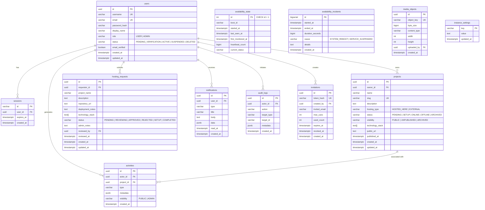

# Database Architecture & Schema Reference

> **Database:** PostgreSQL 16  
> **Driver:** `jackc/pgx/v5` via connection pool (`pgxpool.Pool`)  
> **Migrations Directory:** `backend/migrations/`  
> **Location:** [`docs/backend/database.md`](./database.md)

---

## 1. Entity Relationship Diagram (ERD)

---

## 2. Table Specifications & Invariants

### 2.1. Identity & Sessions
- **`users`**:
  - `id`: UUID primary key generated via `gen_random_uuid()`.
  - `role`: Constrained to `'USER'` or `'ADMIN'`. Default is `'USER'`.
  - `password_hash`: Bcrypt hash (cost 10). Plaintext passwords are never stored or logged.
  - `status`: Accounts can be `'ACTIVE'`, `'SUSPENDED'`, or `'PENDING_VERIFICATION'`.
- **`sessions`**:
  - `id`: Random 32-byte hex token string acting as primary key.
  - `user_id`: Foreign key referencing `users(id)` with `ON DELETE CASCADE`.
  - Indexed by `user_id` and `expires_at` for rapid session validation and cleanup.

### 2.2. Project & Hosting Engine
- **`projects`**:
  - `slug`: URL-safe unique identifier (e.g. `https://ngumpul.id/projects/atlas`).
  - `owner_id`: References `users(id)` with `ON DELETE RESTRICT` (users owning live projects cannot be deleted without reassigning or archiving the projects).
  - `status`: Tracks runtime state (`'ONLINE'`, `'OFFLINE'`, `'SETUP'`, `'PENDING'`).
  - `visibility`: Enforces catalog filtering (`'PUBLIC'` vs `'UNPUBLISHED'`).
  - `technology_stack`: Native PostgreSQL array `TEXT[]` allowing indexing and fast array filtering.
- **`hosting_requests`**:
  - `requester_id`: References `users(id)` with `ON DELETE CASCADE`.
  - `status`: Tracks lifecycle (`'PENDING'`, `'REVIEWING'`, `'APPROVED'`, `'REJECTED'`, `'SETUP'`, `'COMPLETED'`).
  - `reviewed_by`: References `users(id)` of the administrator performing the review.

### 2.3. Event Ledger & Governance
- **`activities`**:
  - Immutable public and administrative event stream.
  - `visibility`: Constrained to `'PUBLIC'` (shown on `/activity`) or `'ADMIN'` (shown only in the operator console).
  - `metadata`: Flexible JSONB payload storing project names, links, and operational details.
- **`audit_logs`**:
  - Tamper-resistant operator ledger recording sensitive changes (role promotions, status toggles, quota updates).

### 2.4. Telemetry & Availability State
- **`availability_state`**:
  - Enforced single-row table with constraint `CHECK (id = 1)`.
  - Stores kernel `boot_id`, session start time, and rolling heartbeat timestamp.
  - Eliminates database table bloat by performing updates in-place.
- **`availability_incidents`**:
  - Stores confirmed outages with durations $\ge 120$ seconds.
  - Indexed on `started_at DESC` for fast time-window slicing (`1d`, `7d`, `30d`).

### 2.5. Object Storage & Media Metadata
- **`media_objects`**:
  - Stores metadata of media files persisted in SeaweedFS / S3 / local storage.
  - `object_key`: Unique identifier path (e.g. `covers/{uuid}.webp`, `avatars/{uuid}.webp`).
  - `byte_size`: Enforced hard limit $\le 10\text{ MB}$.
  - `content_type`: Verified image MIME type (`image/jpeg`, `image/png`, `image/webp`).
  - `width` / `height`: Validated dimensions bounded to prevent decompression bombs ($\le 4096\text{px}$).

### 2.6. Access Control & Invitations
- **`instance_settings`**:
  - Key-value configuration for the single-instance community node.
  - Primary key `key` (`VARCHAR(64)`), `value` (`TEXT`), `updated_at`.
  - Default entry: `registration_mode = 'INVITE_ONLY'` (`OPEN` | `INVITE_ONLY` | `CLOSED`).
- **`invitations`**:
  - Cryptographic invitation tokens for controlled community entry.
  - `token_hash`: SHA-256 hash of the 32-byte cryptographically secure random token (prevents token leakage if the DB is inspected).
  - `created_by`: Foreign key to `users(id)` with `ON DELETE SET NULL`.
  - `invited_email`: Optional email address constraint. If set, only matching applicant emails can consume the token.
  - `max_uses` / `used_count`: Usage quota enforcement.
  - `expires_at`: Expiration timestamp.
  - `revoked_at`: Immediate invalidation flag.
  - Atomic consumption via `SELECT ... FOR UPDATE` row locking during registration transaction.
