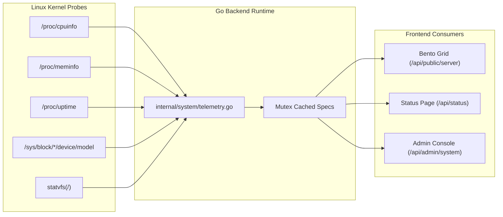

# Native Host Telemetry Engine

> **Component:** Telemetry & Hardware Probing (`backend/internal/system`)  
> **Source Files:** `telemetry.go`, `handler.go`, `proc.go`  
> **Philosophy:** Direct Linux kernel reading with zero monitoring daemon overhead  
> **Location:** [`docs/backend/telemetry.md`](./telemetry.md)

---

## 1. Overview & Architectural Approach

Ngumpul Host avoids running heavyweight background telemetry agents (such as Prometheus node_exporter or Datadog) on the host machine. Instead, the backend reads directly from the Linux `/proc` and `/sys` virtual filesystems.



---

## 2. Kernel Telemetry Sources & Calculations

### 2.1. Processor & Compute Architecture (`/proc/cpuinfo`)
- **Model Clean-up:** Strips marketing noise (e.g. converting `13th Gen Intel(R) Core(TM) i5-1334U` into `13th Gen Intel Core i5-1334U`).
- **Core & Thread Topology:**
  - Scans for unique `core id` and `physical id` to identify physical cores.
  - Counts the total `processor` entries to obtain logical hyperthread capacity.
- **Clock Speed:** Reads `cpu MHz` across all cores to compute average current clock frequency.

### 2.2. Memory Allocation & Real Workload (`/proc/meminfo`)
Rather than relying on naive `MemFree` (which ignores cached memory and reports artificially low availability), the engine uses the Linux kernel's `MemAvailable`:

$$\text{Used RAM} = \text{MemTotal} - \text{MemAvailable}$$
$$\text{Usage \%} = \text{round}\left( \frac{\text{Used RAM}}{\text{MemTotal}} \times 100 \right)$$
$$\text{Total GB} = \text{round}\left( \frac{\text{MemTotal}}{1024 \times 1024}, 1 \right)$$
$$\text{Available GB} = \text{round}\left( \frac{\text{MemAvailable}}{1024 \times 1024}, 1 \right)$$

### 2.3. Storage Hierarchy & NVMe Hardware Probing
- **Filesystem Boundaries (`golang.org/x/sys/unix.Statvfs`):**
  - Executes the POSIX `statvfs` syscall against mount point `/`.
  - Calculates partition size:
    $$\text{Linux Total Bytes} = \text{Blocks} \times \text{Bsize}$$
    $$\text{Linux Available Bytes} = \text{Bavail} \times \text{Bsize}$$
- **Physical Disk Model Discovery (`/sys/block`):**
  - Iterates through `/sys/block/nvme*n1/device/model` to identify high-speed NVMe flash drives (e.g. `SAMSUNG MZVL4512HBLU-00BH1`).
  - Falls back to `/sys/block/sd*/device/model` for SATA SSDs.
  - Reports both the **raw hardware disk capacity** (e.g. 512 GB) and the **dedicated Linux partition** (e.g. 98 GB).

### 2.4. Edge Network Latency Probe
- **Target:** Cloudflare DNS edge (`1.1.1.1:443`).
- **Mechanism:** A non-blocking TCP handshake measured via `time.Since(start)`.
- **Concurrency & Caching:** Wrapped in a read-write mutex (`sync.RWMutex`) with a 60-second time-to-live (TTL). If a request arrives within the cache window, it returns the cached latency in `~0ms` without making an outbound network request.

---

## 3. Data Contract (`GET /api/public/server`)

```json
{
  "hardware": {
    "cpu": "13th Gen Intel Core i5-1334U",
    "cores": 10,
    "threads": 12,
    "clockSpeed": "1.3 - 4.6 GHz",
    "architecture": "x86_64"
  },
  "memory": {
    "totalGB": 23.1,
    "availableGB": 6.4,
    "usagePercent": 72
  },
  "storage": {
    "physicalDiskGB": 512,
    "linuxTotalGB": 98,
    "availableGB": 6.8,
    "usagePercent": 93,
    "type": "NVMe SSD",
    "model": "SAMSUNG MZVL4512HBLU-00BH1",
    "summary": "SAMSUNG MZVL4512HBLU-00BH1 · 512GB NVMe SSD (98GB Linux Partition)"
  },
  "network": {
    "linkCapacity": "1 Gbps",
    "latencyMs": 28
  },
  "os": {
    "distro": "Ubuntu 24.04 LTS / Linux 6.8",
    "location": "Jakarta, Indonesia"
  }
}
```
