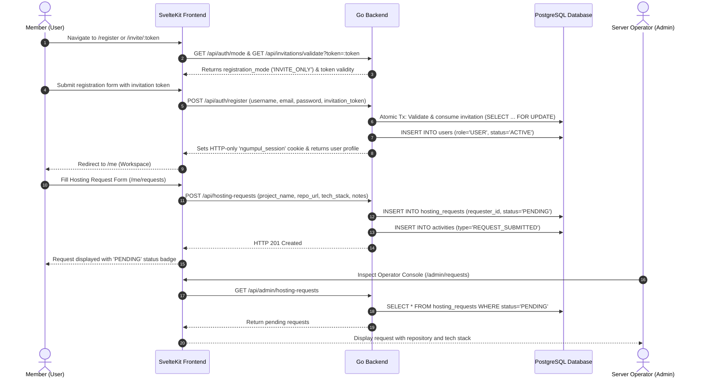
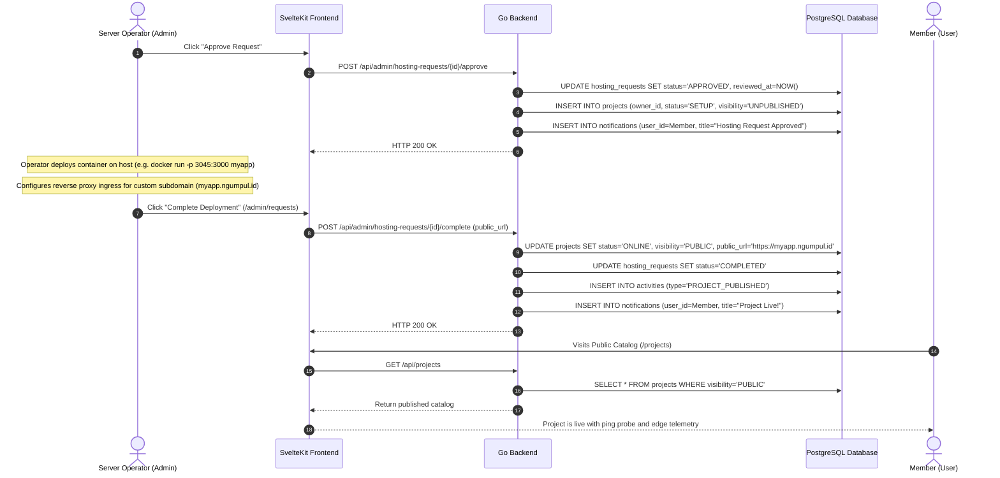
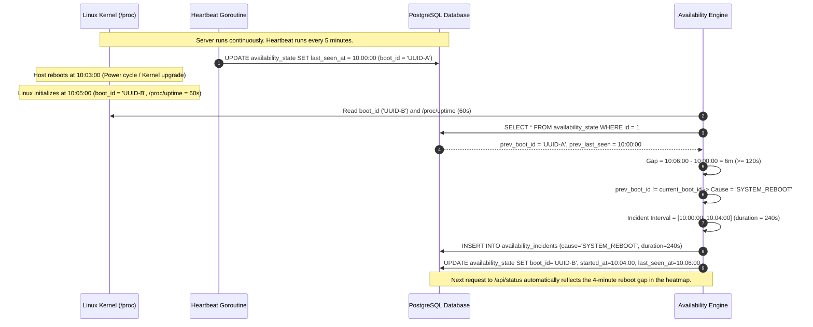
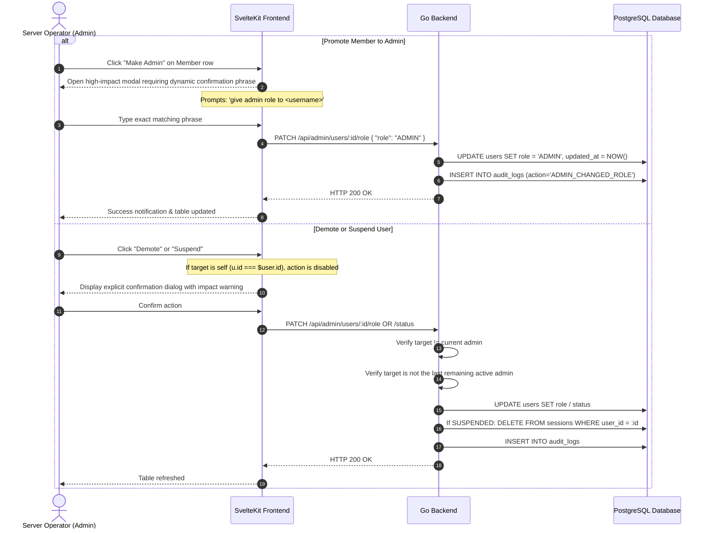
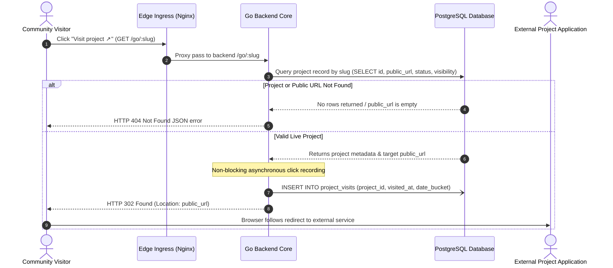
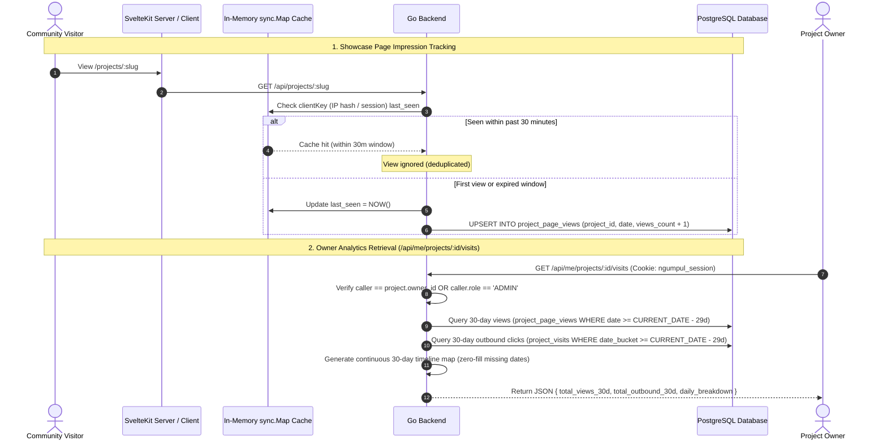

# Operational Workflows & End-to-End Scenarios

> **Component:** End-to-End Scenarios & Lifecycle Sequences  
> **Target Audience:** Core Contributors, Operators & AI Agents

---

## 1. Member Onboarding & Hosting Request Workflow

This workflow documents a new user joining the community, submitting an application for hosting, and receiving confirmation:



---

## 2. Operator Review, Container Provisioning & Publication

This workflow documents how the operator approves the request, provisions the container on the host node, and publishes the project:



---

## 3. Host Reboot & Automated Downtime Gap Reconciliation

This workflow documents how the system detects host reboots without active heartbeat polling:



---

## 4. Administrative Member Moderation & Role Safeguards

This workflow documents safety invariants and confirmation controls when managing members and roles (`/admin/users`):



### Safety Invariants:
1. **Self-Action Prevention:** An administrator cannot demote or suspend their own account in either frontend UI or backend API.
2. **Last Administrator Protection:** The backend rejects any attempt to demote or suspend the last active administrator on the system, preventing instance lockout.
3. **GitHub-Style Dynamic Typed Phrase:** Promoting any member to administrator requires typing `give admin role to <username>`, preventing accidental privilege elevation.
4. **Interactive Confirmation Modals:** Demoting an administrator, suspending an account, or restoring access requires confirmation with transparent consequence descriptions.

---

## 5. Outbound Project Redirect Engine (`/go/:slug`)

This workflow documents how community visitors navigate from Ngumpul Host showcase pages to external deployed applications while securely and anonymously recording outbound visit metrics:



### Architectural & Privacy Guarantees:
1. **Asynchronous Non-Blocking Execution:** Click recording occurs in a lightweight background goroutine (`go func() { ... }()`) with a 5-second context timeout. Visitor redirection is never delayed by database write latency.
2. **Zero Client Fingerprinting:** Outbound visit records strictly store `(project_id, visited_at, CURRENT_DATE)`. The system intentionally does **NOT** store client IP addresses, browser cookies, Canvas fingerprints, or third-party ad beacons.
3. **Dual-Layer Ingress Reliability:**
   - **Primary Layer (Nginx):** Route `location /go/` forwards directly to `backend_upstream` with zero Node.js overhead.
   - **Fallback Layer (SvelteKit):** Universal endpoint in `src/routes/go/[slug]/+server.ts` handles SSR/direct edge fallback, guaranteeing redirection even if ingress routing is bypassed during local development.

---

## 6. Project Traffic Analytics, Impression Deduplication & 30-Day Aggregation Engine

Ngumpul Host provides project owners with calm, actionable visibility into their application's reach without corporate surveillance tooling:



### Technical Invariants:
1. **30-Minute Impression Deduplication:** `RecordPageView` uses a thread-safe `sync.Map` in the Go backend. Repeated refreshes, rapid clicks, or bot crawls from the same IP/session within a 30-minute window increment zero database counters.
2. **Continuous Zero-Filled 30-Day Timeline:** The `GetProjectVisits` handler initializes a 30-day date map (`dailyMap`) from `NOW() - 29 days` to `TODAY`. Missing days are preserved as `0 views` and `0 visits`, ensuring frontend line charts and bento metric widgets render smooth, gapless visualizations.
3. **Strict Authorization Gate:** Non-owners cannot inspect other members' traffic statistics. Access is restricted strictly to the project creator or instance operators.

---

## 7. Smart External Link & Platform Auto-Detection (`linkDetector.ts`)

Instead of forcing users into rigid, fragmented form inputs, Ngumpul Host allows creators to provide up to 5 arbitrary external links while automatically inferring the service, domain, brand iconography, and human labels:

```
User Input URL ───► URL Hostname Parser ───► Domain Matcher ───► Curated Phosphor Icon + Label
```

### Detection Matrix:

| Domain Match | Platform Identified | Phosphor Icon | Default Label Rendered |
| :--- | :--- | :--- | :--- |
| `github.com` | GitHub Repository | `<GithubLogo weight="regular" />` | `GitHub` |
| `gitlab.com` | GitLab Repository | `<GitlabLogo weight="regular" />` | `GitLab` |
| `drive.google.com` | Google Drive Cloud Storage | `<GoogleDriveLogo weight="regular" />` | `Google Drive` |
| `docs.google.com` | Google Docs Specification | `<FileText weight="regular" />` | `Google Docs` |
| `figma.com` | Figma Design Workspace | `<FigmaLogo weight="regular" />` | `Figma` |
| `youtube.com`, `youtu.be` | YouTube Video Demo | `<YoutubeLogo weight="regular" />` | `YouTube Demo` |
| `vimeo.com` | Vimeo Video Demo | `<YoutubeLogo weight="regular" />` | `Video Demo` |
| `twitter.com`, `x.com` | X / Twitter Profile | `<TwitterLogo weight="regular" />` | `X (Twitter)` |
| `discord.gg`, `discord.com` | Discord Community Server | `<DiscordLogo weight="regular" />` | `Discord` |
| `notion.so`, `notion.site` | Notion Documentation | `<FileText weight="regular" />` | `Notion Docs` |
| *Any other valid URL* | Generic External Website | `<LinkSimple weight="regular" />` | Clean hostname or fallback |

### Frontend Consumption:
```svelte
<script lang="ts">
    import { detectLinkInfo } from '$lib/utils/linkDetector';
    
    // Example: Dynamically detect external link
    const info = detectLinkInfo(project.demo_url, 'Live Demo');
    const IconComponent = info.icon;
</script>

<a href={project.demo_url} target="_blank" rel="noopener noreferrer" class="flex items-center gap-2 text-sm text-neutral-600 dark:text-neutral-300 hover:text-sky-500">
    <IconComponent size={16} />
    <span>{info.label}</span>
</a>
```


