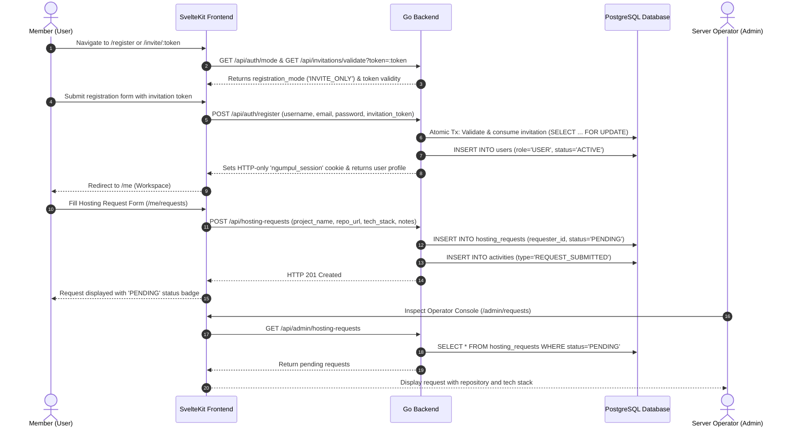
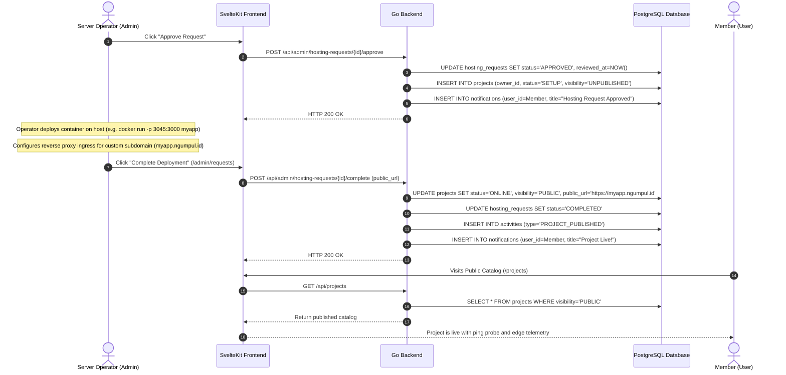
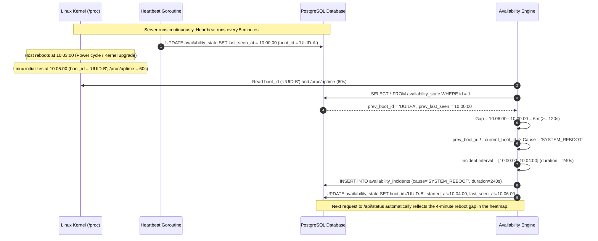
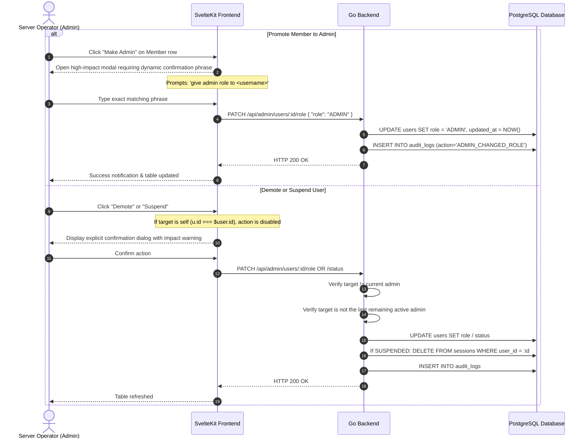

# Operational Workflows & End-to-End Scenarios

> **Component:** End-to-End Scenarios & Lifecycle Sequences  
> **Target Audience:** Core Contributors, Operators & AI Agents

---

## 1. Member Onboarding & Hosting Request Workflow

This workflow documents a new user joining the community, submitting an application for hosting, and receiving confirmation:

---

## 2. Operator Review, Container Provisioning & Publication

This workflow documents how the operator approves the request, provisions the container on the host node, and publishes the project:

---

## 3. Host Reboot & Automated Downtime Gap Reconciliation

This workflow documents how the system detects host reboots without active heartbeat polling:

---

## 4. Administrative Member Moderation & Role Safeguards

This workflow documents safety invariants and confirmation controls when managing members and roles (`/admin/users`):

### Safety Invariants:
1. **Self-Action Prevention:** An administrator cannot demote or suspend their own account in either frontend UI or backend API.
2. **Last Administrator Protection:** The backend rejects any attempt to demote or suspend the last active administrator on the system, preventing instance lockout.
3. **GitHub-Style Dynamic Typed Phrase:** Promoting any member to administrator requires typing `give admin role to <username>`, preventing accidental privilege elevation.
4. **Interactive Confirmation Modals:** Demoting an administrator, suspending an account, or restoring access requires confirmation with transparent consequence descriptions.

